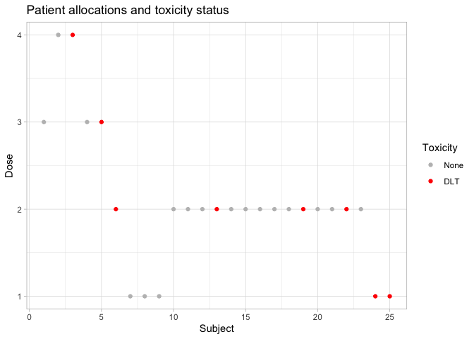

<!-- README.md is generated from README.Rmd. Please edit that file -->
crmReporter
===========

The `crmReporter` package is designed to provide a simple interface between `crmPack` (and other MCMC packages) and [the tidyverse](www.tidyverse.org) and to augment the reporting facilities provided by `crmPack`, `coda`, `runjags` and other packages relating to MCMC simulation.

Installation
------------

`crmReporter` is available from GitHub. To install it, use

``` r
devtools::install_github("PuzzledFace/crmReporter")
```

Creating tidy data
------------------

Creating tidy data with `crmReporter` is simple: use the `tidy()` verb. Tidy works with `mcmc`s, `mcmc.list`s, `runjags`s and `runjags.list`s.

``` r
library(crmReporter)
#> Registered S3 method overwritten by 'crmPack':
#>   method       from  
#>   print.gtable gtable

data("oCRMPosteriorShort")
x <- oCRMPosteriorShort %>% tidy()
x %>% head()
#> # A tibble: 6 x 5
#>   Chain Sample Parameter Index Value
#>   <int> <chr>  <chr>     <int> <dbl>
#> 1     1 5001   alpha         1 7.27 
#> 2     1 5001   alpha         2 3.10 
#> 3     1 5001   beta         NA 0.959
#> 4     1 5003   alpha         1 5.73 
#> 5     1 5003   alpha         2 4.66 
#> 6     1 5003   beta         NA 0.886
```

You can use the output from `tidy()` as input to other `crmReporter` functions or to your own code built within the Tidyverse. Here are some sample outputs from `crmReporter` functions. They all use data from the first example study in the original O'Quigley paper.

<table>
<thead>
<tr>
<th style="border-bottom:hidden" colspan="1">
</th>
<th style="border-bottom:hidden; padding-bottom:0; padding-left:3px;padding-right:3px;text-align: center; " colspan="2">
Number of patients

</th>
<th style="border-bottom:hidden; padding-bottom:0; padding-left:3px;padding-right:3px;text-align: center; " colspan="2">
Status

</th>
</tr>
<tr>
<th style="text-align:right;">
Dose
</th>
<th style="text-align:right;">
Treated
</th>
<th style="text-align:right;">
Evaluable
</th>
<th style="text-align:right;">
No Tox
</th>
<th style="text-align:right;">
DLT
</th>
</tr>
</thead>
<tbody>
<tr>
<td style="text-align:right;">
0
</td>
<td style="text-align:right;">
0
</td>
<td style="text-align:right;">
0
</td>
<td style="text-align:right;">
0
</td>
<td style="text-align:right;">
0
</td>
</tr>
<tr>
<td style="text-align:right;">
1
</td>
<td style="text-align:right;">
5
</td>
<td style="text-align:right;">
5
</td>
<td style="text-align:right;">
3
</td>
<td style="text-align:right;">
2
</td>
</tr>
<tr>
<td style="text-align:right;">
2
</td>
<td style="text-align:right;">
15
</td>
<td style="text-align:right;">
15
</td>
<td style="text-align:right;">
11
</td>
<td style="text-align:right;">
4
</td>
</tr>
<tr>
<td style="text-align:right;">
3
</td>
<td style="text-align:right;">
3
</td>
<td style="text-align:right;">
3
</td>
<td style="text-align:right;">
2
</td>
<td style="text-align:right;">
1
</td>
</tr>
<tr>
<td style="text-align:right;">
4
</td>
<td style="text-align:right;">
2
</td>
<td style="text-align:right;">
2
</td>
<td style="text-align:right;">
1
</td>
<td style="text-align:right;">
1
</td>
</tr>
</tbody>
</table>
 
<table>
<thead>
<tr>
<th style="border-bottom:hidden" colspan="5">
</th>
<th style="border-bottom:hidden; padding-bottom:0; padding-left:3px;padding-right:3px;text-align: center; " colspan="6">
p(Tox)

</th>
</tr>
<tr>
<th style="border-bottom:hidden" colspan="1">
</th>
<th style="border-bottom:hidden; padding-bottom:0; padding-left:3px;padding-right:3px;text-align: center; " colspan="4">
Patients

</th>
<th style="border-bottom:hidden" colspan="1">
</th>
<th style="border-bottom:hidden; padding-bottom:0; padding-left:3px;padding-right:3px;text-align: center; " colspan="5">
Quantiles

</th>
</tr>
<tr>
<th style="text-align:right;">
Dose
</th>
<th style="text-align:right;">
Treated
</th>
<th style="text-align:right;">
Evaluable
</th>
<th style="text-align:right;">
No Tox
</th>
<th style="text-align:right;">
Tox
</th>
<th style="text-align:right;">
Mean
</th>
<th style="text-align:right;">
5%
</th>
<th style="text-align:right;">
10%
</th>
<th style="text-align:right;">
Median
</th>
<th style="text-align:right;">
90%
</th>
<th style="text-align:right;">
95%
</th>
</tr>
</thead>
<tbody>
<tr>
<td style="text-align:right;">
1
</td>
<td style="text-align:right;">
5
</td>
<td style="text-align:right;">
5
</td>
<td style="text-align:right;">
3
</td>
<td style="text-align:right;">
2
</td>
<td style="text-align:right;">
0.22
</td>
<td style="text-align:right;">
0.02
</td>
<td style="text-align:right;">
0.16
</td>
<td style="text-align:right;">
0.22
</td>
<td style="text-align:right;">
0.27
</td>
<td style="text-align:right;">
0.67
</td>
</tr>
<tr>
<td style="text-align:right;">
2
</td>
<td style="text-align:right;">
15
</td>
<td style="text-align:right;">
15
</td>
<td style="text-align:right;">
11
</td>
<td style="text-align:right;">
4
</td>
<td style="text-align:right;">
0.31
</td>
<td style="text-align:right;">
0.05
</td>
<td style="text-align:right;">
0.25
</td>
<td style="text-align:right;">
0.31
</td>
<td style="text-align:right;">
0.37
</td>
<td style="text-align:right;">
0.74
</td>
</tr>
<tr>
<td style="text-align:right;">
3
</td>
<td style="text-align:right;">
3
</td>
<td style="text-align:right;">
3
</td>
<td style="text-align:right;">
2
</td>
<td style="text-align:right;">
1
</td>
<td style="text-align:right;">
0.44
</td>
<td style="text-align:right;">
0.13
</td>
<td style="text-align:right;">
0.38
</td>
<td style="text-align:right;">
0.44
</td>
<td style="text-align:right;">
0.50
</td>
<td style="text-align:right;">
0.81
</td>
</tr>
<tr>
<td style="text-align:right;">
4
</td>
<td style="text-align:right;">
2
</td>
<td style="text-align:right;">
2
</td>
<td style="text-align:right;">
1
</td>
<td style="text-align:right;">
1
</td>
<td style="text-align:right;">
0.54
</td>
<td style="text-align:right;">
0.22
</td>
<td style="text-align:right;">
0.48
</td>
<td style="text-align:right;">
0.54
</td>
<td style="text-align:right;">
0.60
</td>
<td style="text-align:right;">
0.85
</td>
</tr>
<tr>
<td style="text-align:right;">
5
</td>
<td style="text-align:right;">
0
</td>
<td style="text-align:right;">
0
</td>
<td style="text-align:right;">
0
</td>
<td style="text-align:right;">
0
</td>
<td style="text-align:right;">
0.70
</td>
<td style="text-align:right;">
0.42
</td>
<td style="text-align:right;">
0.66
</td>
<td style="text-align:right;">
0.70
</td>
<td style="text-align:right;">
0.74
</td>
<td style="text-align:right;">
0.91
</td>
</tr>
<tr>
<td style="text-align:right;">
6
</td>
<td style="text-align:right;">
0
</td>
<td style="text-align:right;">
0
</td>
<td style="text-align:right;">
0
</td>
<td style="text-align:right;">
0
</td>
<td style="text-align:right;">
0.83
</td>
<td style="text-align:right;">
0.64
</td>
<td style="text-align:right;">
0.81
</td>
<td style="text-align:right;">
0.83
</td>
<td style="text-align:right;">
0.86
</td>
<td style="text-align:right;">
0.95
</td>
</tr>
</tbody>
</table>
    #> Warning: Unknown or uninitialised column: `Parameter`.

 
